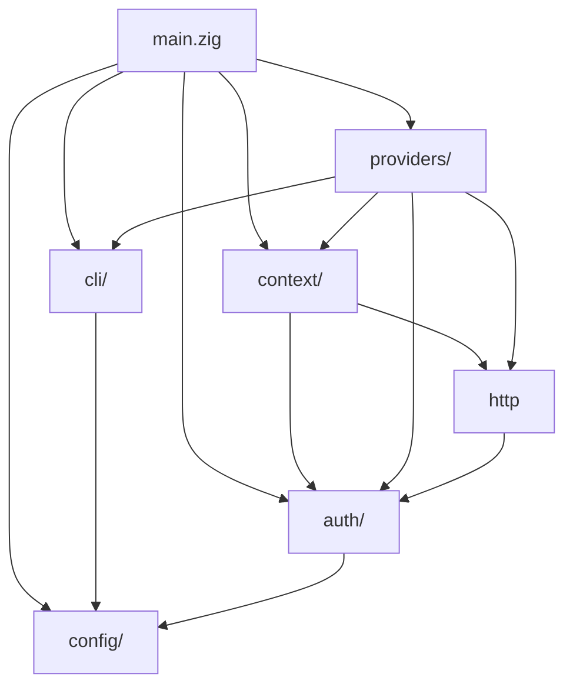

# Architecture

## Capability-Driven Provider Model

Instead of a monolithic `Provider` interface, each provider exposes optional capability vtables:

```
Capability      GitHub              GitLab              Gitea/Forgejo
─────────       ──────              ──────              ─────────────
repos           RepoVtable          RepoVtable          RepoVtable
issues          IssueVtable         IssueVtable         IssueVtable
prs             PRVtable            PRVtable (MRs)      PRVtable
releases        ReleaseVtable       ReleaseVtable       ReleaseVtable
pipelines       PipelineVtable      PipelineVtable      null
```

A provider without a capability sets its vtable to `null`. The command dispatch checks before calling and returns a clear "not supported" message. No lowest-common-denominator trap.

The `custom` provider ships with all capabilities set to `null` — users provide their own API via `--provider-url`. This enables working with any Git forge that has a REST API.

---

## Resolution Chain

For every command, the context engine resolves:

1. **Explicit flag**: `--provider github` or `--account personal`
2. **Git remote detection**: Parse `git remote -v`, match URL patterns to known providers
3. **Config fallback**: `defaults.provider` from `~/.gctl/config.json`
4. **Error**: "No provider detected. Run `gctl context` to debug."

Custom provider detection:
- If `--provider custom` is passed, the override takes priority regardless of what the remote URL matches
- If remote exists but doesn't match a known provider pattern (github/gitlab/gitea), it auto-detects as `custom`
- `--provider-url` passes through to `providers.execute()` for API calls

---

## Token Resolution

Tokens are resolved in priority order:

1. **Environment variables**: `GITHUB_TOKEN`, `GITLAB_TOKEN`, `GITEA_TOKEN`, `TOKEN` (generic fallback)
2. **OS keychain**: macOS Keychain, Linux Secret Service (v1.0+)
3. **Encrypted config file**: AES-encrypted fallback (v1.0+)

v0.1–v0.5 use env vars exclusively. Token env var mapping:

| Provider | Env Var |
|----------|---------|
| `github` | `GITHUB_TOKEN` |
| `gitlab` | `GITLAB_TOKEN` |
| `gitea` | `GITEA_TOKEN` |
| `custom` | `TOKEN` (generic fallback) |

The `upperProvider` function normalizes provider names for env lookup (e.g., `github` → `GITHUB`, `custom` → `TOKEN`).

---

## Directory Structure

```
/Volumes/EXT/gctl/
├── build.zig                 # Build system: modules, targets, tests
├── build.zig.zon             # Package manifest: name, version, deps (none)
├── README.md                 # User-facing overview
├── docs/
│   ├── specs/                # Specification documents
│   │   ├── index.md
│   │   ├── architecture.md
│   │   ├── commands.md
│   │   ├── providers.md
│   │   ├── config.md
│   │   ├── error-handling.md
│   │   └── design-decisions.md
│   ├── development.md        # Build, test, run guide
│   └── contributing.md       # Contribution guidelines
├── src/
│   ├── main.zig              # Entry point, arg dispatch, error handling
│   ├── cli/
│   │   ├── mod.zig            # CLI module root
│   │   ├── args.zig           # Arg parsing: flags anywhere, multi-word commands
│   │   └── output.zig         # Table rendering, --json flag, ANSI color
│   ├── context/
│   │   ├── mod.zig            # Context resolution engine
│   │   └── remote.zig         # Parse `git remote -v`, map URL→provider+owner+repo
│   ├── providers/
│   │   ├── mod.zig            # Provider registry (comptime map)
│   │   ├── types.zig          # Capability enum, vtable types, shared response types
│   │   ├── github.zig         # GitHub REST v3
│   │   ├── gitlab.zig         # GitLab API v4
│   │   └── gitea.zig          # Gitea/Forgejo API v1
│   ├── config/
│   │   ├── mod.zig            # Config read/write, account management
│   │   └── schema.zig         # Config types (accounts array, defaults)
│   ├── auth/
│   │   ├── mod.zig            # Token resolution: env vars → config → keychain
│   │   ├── env.zig            # Provider token env var support
│   │   ├── keychain.zig       # macOS `security` / Linux `secret-tool`
│   │   └── oauth.zig          # GitHub device flow (v1.0+)
│   └── http/
│       ├── mod.zig            # HTTP module root
│       └── client.zig         # std.http.Client wrapper: auth, retry, rate-limit
└── tests/
    ├── context_test.zig       # Git remote parsing, provider resolution
    ├── cli_test.zig           # Arg parsing for each command variant
    └── github_test.zig        # API response parsing (mock data)
```

### Module Dependency Graph


