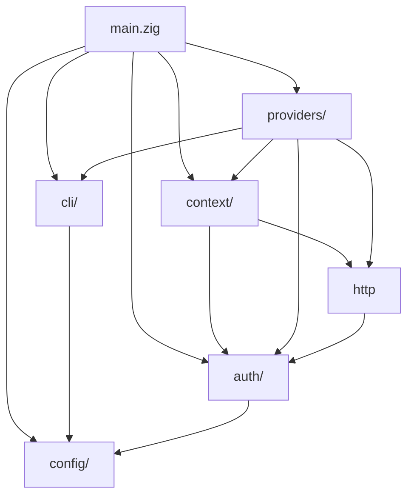

# Architecture

## Capability-Driven Provider Model

Instead of a monolithic `Provider` interface, each provider exposes optional capability vtables:

```
Capability      GitHub              GitLab
─────────       ──────              ──────
repos           RepoVtable          RepoVtable
issues          IssueVtable         IssueVtable
prs             PRVtable            PRVtable (MRs)
labels          LabelVtable         LabelVtable
```

A provider without a capability sets its vtable to `null`. The command dispatch checks before calling and returns a clear "not supported" message. No lowest-common-denominator trap.

The `custom` provider ships with all capabilities set to `null` — users provide their own API via `--provider-url`. This enables working with any Git forge that has a REST API.

**Vtable philosophy**: Start with 3 vtables (repos, issues, prs). Add labels when needed. Do NOT add releases, pipelines, or other vtables until a real user workflow demands them. Use `gctl api` as the escape hatch for unsupported operations.

### RepoVtable

```zig
pub const RepoVtable = struct {
    view:    *const fn (allocator, token, owner, repo) anyerror!RepoInfo,
    create:  *const fn (allocator, token, owner, params) anyerror!RepoInfo,
    delete:  *const fn (allocator, token, owner, repo) anyerror!void,
    archive: *const fn (allocator, token, owner, repo, archived: bool) anyerror!RepoInfo,
};
```

### IssueVtable

```zig
pub const IssueVtable = struct {
    list:   *const fn (allocator, token, owner, repo) anyerror![]IssueInfo,
    view:   *const fn (allocator, token, owner, repo, number: u64) anyerror!IssueInfo,
    create: *const fn (allocator, token, owner, repo, params: IssueCreateParams) anyerror!IssueInfo,
    close:  *const fn (allocator, token, owner, repo, number: u64) anyerror!IssueInfo,
};
```

### PRVtable

```zig
pub const PRVtable = struct {
    list:   *const fn (allocator, token, owner, repo) anyerror![]PullRequestInfo,
    view:   *const fn (allocator, token, owner, repo, number: u64) anyerror!PullRequestInfo,
    create: *const fn (allocator, token, owner, repo, params: PRCreateParams) anyerror!PullRequestInfo,
    merge:  *const fn (allocator, token, owner, repo, number: u64) anyerror!void,
};
```

### LabelVtable

```zig
pub const LabelVtable = struct {
    set_all: *const fn (allocator, token, owner, repo, params: LabelParams) anyerror!void,
};
```

---

## Cross-Provider Operations

Cross-provider operations work between any two resolved contexts, even across different providers (GitHub → GitLab).

### Resource Path Syntax

Resources are addressed as REST-style paths:

```
[<remote>/]<type>/[<id>]
```

| Path | Meaning |
|------|---------|
| `issues/14` | Issue #14 in current context |
| `upstream/prs/42` | PR #42 on upstream remote |
| `origin/labels/bug` | Label "bug" on origin |
| `issues/` | All issues (bulk operations) |

The type segment maps directly to the REST API endpoints of the underlying providers (`/repos/{o}/{r}/issues`, `/repos/{o}/{r}/pulls`, etc.). Adding a new resource type requires no CLI changes — only a new vtable and a `Type` entry.

### Model: export/import as Unix Filters

Cross-provider transfer follows the Unix pipe model:

```
gctl export <resource-path>              → JSON on stdout
gctl import <resource-path>              → reads JSON from stdin
gctl copy <source-path> <target-remote>  → export | import (composition)
```

```
gctl export issues/14 | jq '.title'              # inspect
gctl export issues/14 > issue.json               # save to file
gctl export issues/14 | gctl import upstream/issues/  # pipe across remotes
gctl export issues/ | gctl import upstream/issues/   # bulk copy all
```

This composes with any Unix tool and avoids creating a custom transfer protocol.

### Implementation: No Adapter Vtable

`export` = `view()` on the source provider → serialize the existing `Info` struct to JSON.
`import` = deserialize JSON → populate `CreateParams` → `create()` on the target provider.

```
export:  view(id)  → IssueInfo  → JSON
import:  JSON      → IssueCreateParams → create(params)
copy:    export(source) | import(target)  [internal pipe]
```

No separate `ResourceAdapter` vtable or `ResourceBlob` type. The only code change needed: `CreateParams` structs must accept all writable fields from their corresponding `Info` struct (labels, state, etc. as optionals).

```zig
// IssueCreateParams enriched for copy
pub const IssueCreateParams = struct {
    title: []const u8,
    body: ?[]const u8 = null,
    labels: ?[]const []const u8 = null,
    state: ?[]const u8 = null,
};
```

### Resource Type Registration

Resource types are registered in a comptime map alongside capability vtables:

```zig
pub const ResourceType = enum {
    issues,
    prs,
    labels,
    releases,
    runs,
};
```

A provider declares which resource types it supports via its existing capability vtables. If a vtable is `null`, the resource type is not available on that provider.

### Sync Strategy

- `copy` — one-shot: read from source, write to target, report result
- `diff` — compare resources between two contexts by type (lists items present in source but missing on target)
- Direction is always explicit (positional remote names). No auto-detection to avoid surprises.

---

## Resolution Chain

For every command, the context engine resolves:

1. **Explicit flag**: `--provider github` or `--account personal`
2. **Git remote detection**: Parse `git remote -v`, match URL patterns to known providers
3. **Config fallback**: `defaults.provider` from `~/.gctl/config.json`
4. **Error**: "No provider detected. Run `gctl doctor --quick` to debug."

### Multi-Context Resolution

All git remotes are parsed, not just the first. The resolver returns a slice of contexts:

```zig
pub fn resolve(allocator, provider_override, provider_url) ![]ResolvedContext
```

- Single-repo commands (issue list, pr view) implicitly use `contexts[0]` (the first fetch remote)
- `gctl doctor` shows diagnostics (local checks only with `--quick`, full API checks without)
- `gctl network` shows all resolved remotes with provider, owner, repo (verbose table with `--all`)
- Cross-provider commands (`copy`, `diff`) accept a source/target remote pair

Custom provider detection:
- If `--provider custom` is passed, the override takes priority regardless of what the remote URL matches
- If remote exists but doesn't match a known provider pattern (github/gitlab), it auto-detects as `custom`
- `--provider-url` passes through to `providers.execute()` for API calls

---

## Token Resolution

Tokens are resolved in priority order:

1. **Environment variables**: `GITHUB_TOKEN`, `GITLAB_TOKEN`, `TOKEN` (generic fallback)
2. **OS keychain**: macOS Keychain, Linux Secret Service (planned)

3. **Encrypted config file**: AES-encrypted fallback (planned)
Pre-keychain token resolution uses env vars exclusively. Token env var mapping:

| Provider | Env Var |
|----------|---------|
| `github` | `GITHUB_TOKEN` |
| `gitlab` | `GITLAB_TOKEN` |
| `custom` | `TOKEN` (generic fallback) |

The `upperProvider` function normalizes provider names for env lookup (e.g., `github` → `GITHUB`, `custom` → `TOKEN`).

---

## Directory Structure

```
gctl/
├── build.zig                 # Build system: modules, targets, tests
├── build.zig.zon             # Package manifest (no deps)
├── README.md                 # User-facing overview
├── CONTRIBUTING.md           # Build, test, branching, coding guide
├── docs/
│   └── specs/                # Specification documents
│       ├── index.md
│       ├── architecture.md
│       ├── commands.md
│       ├── providers.md
│       ├── config.md
│       ├── error-handling.md
│       └── design-decisions.md
├── src/
│   ├── main.zig              # Entry point, arg dispatch, error handling
│   ├── cli/
│   │   ├── mod.zig            # CLI module root
│   │   ├── args.zig           # Arg parsing: flags anywhere, multi-word commands
│   │   └── output.zig         # Table rendering, key-value output, JSON-ready
│   ├── context/
│   │   ├── mod.zig            # Context resolution engine
│   │   └── remote.zig         # Parse git remote -v, map URL→provider+owner+repo
│   ├── providers/
│   │   ├── mod.zig            # Provider registry (comptime map)
│   │   ├── types.zig          # Capability enum, vtable types, shared response types
│   │   ├── github.zig         # GitHub REST v3
│   │   ├── gitlab.zig         # GitLab API v4
│   │   └── gitea.zig          # Stub — planned if users need
│   ├── config/
│   │   ├── mod.zig            # Config read/write, account management
│   │   └── schema.zig         # Config types (accounts array, defaults)
│   ├── auth/
│   │   ├── mod.zig            # Token resolution: env vars → config → keychain
│   │   ├── env.zig            # Provider token env var support
│   │   ├── keychain.zig       # Stub — macOS security / Linux secret-tool (planned)
│   │   └── oauth.zig          # Stub — GitHub device flow (planned)
│   └── http/
│       ├── mod.zig            # HTTP module root
│       └── client.zig         # std.http.Client wrapper: GET, POST, PATCH, DELETE
└── tests/
    ├── context_test.zig       # Git remote parsing, provider resolution
    ├── cli_test.zig           # Arg parsing for each command variant
    ├── github_test.zig        # API response parsing (mock data)
    └── gitlab_test.zig        # GitLab API response parsing (mock data)
```

### Module Dependency Graph


